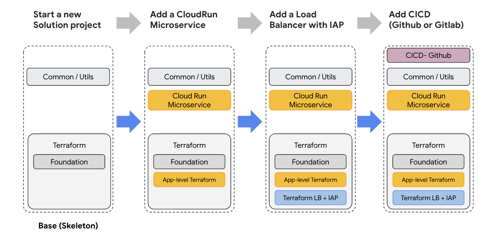

# Google Cloud Solutions Builder

**A solution framework to generate code with built-in structure and modules
to accelerate your project setup.**

## TL;DR

Solutions Builder is a boilerplate tool for building repeatable solutions with the
best practices in architecture on Google Cloud, including Cloud Run, GKE clusters,
Test Automation, CI/CD, etc, with built-in modules including:

- [Terraform](https://www.terraform.io/) boilerplate modules
- Modular microservice templates, deployable to Cloud Run or a Kubernetes cluster.
- Generating code from templates at remote Git repo (e.g. a private Git repo)
- Container image building and deploying with [Skaffold](https://skaffold.dev)
- Modules and templates based on [Copier](https://copier.readthedocs.io/en/stable/).
- CI/CD deployment templates.

## Build a solution by adding modules

Solutions Builder is designed with modules and templates. When creating a new solution
folder, it starts from a base template with a terraform foundation and project skeleton.
Then, you can start adding modules into this solution folder.

For example, these are examples of creating a new solution:

- Start a new solution with a base (skeleton) code from a "root template"
- Add a Cloud Run microservice with APIs
- Add a Load Balancer with Identity-Aware Proxy
- Add CI/CD for deployment



Check out the [Quick Start](#quick-start---create-a-new-solution) section to create a sample solution.

## Prerequisite

| Tool       | Required Version | Installation                                         |
| ---------- | ---------------- | ---------------------------------------------------- |
| Python     | &gt;= 3.11       |                                                      |
| gcloud CLI | Latest           | https://cloud.google.com/sdk/docs/install            |
| Terraform  | &gt;= v1.3.7     | https://developer.hashicorp.com/terraform/downloads  |
| Skaffold   | &gt;= v2.4.0     | https://skaffold.dev/docs/install/#standalone-binary |

[Optional] For deploying to a GKE cluster, please install the following:

| Tool      | Required Version | Installation                                               |
| --------- | ---------------- | ---------------------------------------------------------- |
| Kustomize | &gt;= v5.0.0     | https://kubectl.docs.kubernetes.io/installation/kustomize/ |

Install all packages:

Mac:

```
brew install gcloud terraform skaffold
```

Windows:

```
choco install gcloud terraform skaffold
```

## Install Solutions Builder CLI

```
pip install solutions-builder
```

## Quick Start - Create a new solution

> This quick start steps will create the following:
>
> - Create a new solution folder.
> - Create a new GCP project and initialize Terraform infrastructure.
> - Add a FastAPI-based microservice with a sample API.
> - Deploy the service to Cloud Run.

Generate a new solution in `my-solution-folder` folder.

```
sb new my-solution-folder
```

This will prompt options and variables:

```
🎤 What is your project name? (Spaces are allowed.)
   my awesome solution name
🎤 What is your Google Cloud project ID?
   my-project-id
🎤 Create GCP project 'my-project-id'? (yes/no)
   yes
🎤 Which Google Cloud region?
   us-central1
🎤 Default deploy method? (cloudrun or gke)
   Cloud Run

(...Leave the rest as default)
```

Once answered, it will generate the code from the template:

```
Copying from template
    create  .
    create  .pylintrc
    create  .copier-answers.yml
    ...
```

Answer questions when adding `terraform_base` module:

```
Adding module 'terraform_base'...
🎤 Use GCS Bucket for Terraform backend?
   Yes
🎤 What is your GCP billing account?
   12345-12345-12345
🎤 Use GCS Bucket for Terraform backend?
   Yes

Copying from template
 identical  .
    create  terraform
    create  terraform/stages
    ...


Complete. New solution folder created at ./my-solution-folder.
```

Add a Sample Cloud Run microservice using `blank_service` module template:

```
cd my-solution-folder
sb add component sample_service -t blank_service
```

- Alternatively, use a template from a remote Git repo like:
  ```
   sb add component sample_service -t git@github.com:GoogleCloudPlatform/solutions-builder.git/modules/blank_service
  ```

And answer the following:

```
This will add component 'sample_service' to 'components' folder. Continue? [Y/n]:
🎤 Resource name (lower case, alphanumeric characters, '-')?
   sample-service
🎤 Which Google Cloud region?
   us-central1
🎤 Add a sample API?
   Yes
🎤 Does this component require the Common image?
   No
🎤 Default deploy method? (cloudrun or gke)
   Cloud Run
```

Apply all Terraform stages (in `terraform/stages` folder)

```
sb terraform apply --all --yes
```

The command above will run the following:

- Init and apply all Terraform stages. (`terraform init` and `terraform apply`))
- Build the sample_service container image and published to Artifact Registry. (using [Skaffold](https://skaffold.dev))
- Deploy the sample_service container to Cloud Run. (using Terraform)

> Optionally, manually build and deploy sample_service using `sb deploy`.
>
> ```
> sb deploy -m sample_service
> ```

Once deployed, you can test the Cloud Run instance at:
https://console.cloud.google.com/run/detail/us-central1/sample-service

## CLI Usage

Check out [CLI_USAGE.md](docs/CLI_USAGE.md) for more CLI usages and tutorials.

## Additional Guides

- [cloudshell.md](docs/guides/cloudshell.md) - Step-by-step guidance to run Solutions Builder on Google Cloud Shell.
- [cloudrun.md](docs/guides/cloudrun.md) - The guidance if you want to deploy microservice to Cloud Run.
- [gke.md](docs/guides/gke.md) - The overall development guidance on Google Kubernetes Engine.

## Development and contributions

- [CONTRIBUTIONS.md](CONTRIBUTIONS.md) - How to contribute this project, code submission process.
- [DEVELOPMENT.md](docs/DEVELOPMENT.md) - Guidances on developing new templates, modules, and components.

## Troubleshooting

- [TROUBLESHOOTING.md](docs/TROUBLESHOOTING.md) - Development guide and code submission process.

## FAQ

- Who are the target audience/users for this Solutions Builder?

  - A: Any engineering team to start a new solution development project.

- Can I use this template for non-Google or multi-Cloud environments?
  - A: We design this Solutions Builder to work 100% out of the box with Google Cloud products. However, you could customize the solution to meet your needs on multi-Cloud environment. See [Why Google Cloud](https://cloud.google.com/why-google-cloud) for details.
