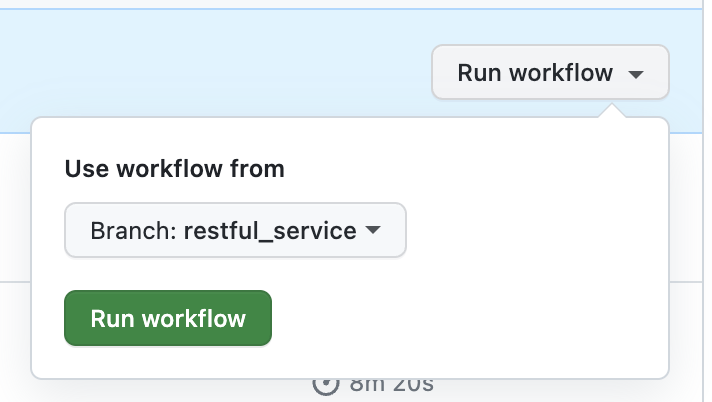
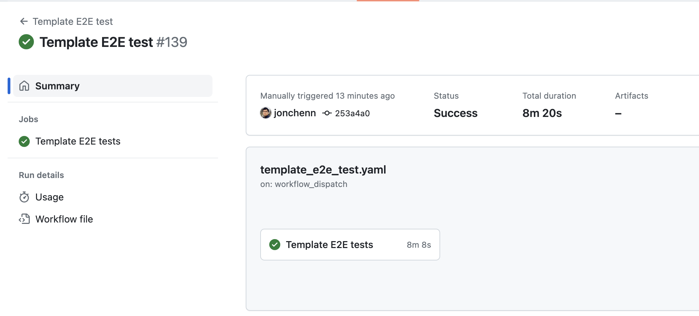

# Solutions Template Development

## Create a new Module

To create a new module, run the following to generate an empty module folder in `solutions_template/modules` folder.
- Optionally, you can specify a different destination if you'd like to create a module in a different repo.

```
st template new <module_name>
```

Answer the prompted questions for this module. For example:
```
🎤 Does this module contain a component as a microservice or frontend app?
   Yes
🎤 Does this module contain terraform stages?
   Yes
🎤 Terraform stage name?
   3-module-name
```

Once complete, it will generate a new module folder, defaultly in `solutions_template/modules` folder.

You can now develop the features for this module.

## Update the Template Root

## Template E2E Tests (for owners only)

Once you update either a new module or existing module code, please run the E2E tests on the Github repo.

- Go to https://github.com/GoogleCloudPlatform/solutions-template/actions/workflows/template_e2e_test.yaml
- Select the feature branch. This will be the same branch used for a Pull Request.
  
- Click **Run workflow**
- Wait for the Github Action run and passed.
  

For more information, check out [e2e/template_e2e_tests/README.md](../e2e/template_e2e_tests/README.md)

## Publish to PyPi package management

Check out the Solutions Template repo:

```
git clone https://github.com/GoogleCloudPlatform/solutions-template
cd solutions-template
```

To development locally with editable files:
```
poetry lock && poetry install
```

Bump a version
```
poetry version patch

# For a minor bump:
poetry version minor

# For a major bump:
poetry version major
```

Build package
```
poetry build
```
- If encountering any errors, run ```poetry build -vvv``` to troubleshoot.

Test package upload to Test-PyPI:
```
# Publish
poetry config repositories.test-pypi https://test.pypi.org/legacy/
poetry config pypi-token.test-pypi $PYPI_TOKEN
poetry publish -r test-pypi

# Install and test
python3 -m pip install --index-url https://test.pypi.org/simple/ solutions-template
```

Publish to official PyPI:
```
# Publish to Test-PyPI
poetry config pypi-token.pypi $PYPI_TOKEN
poetry publish
```
