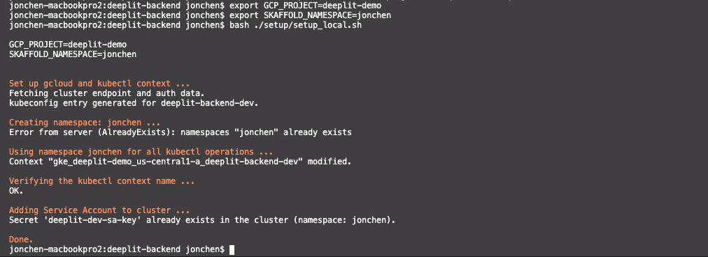
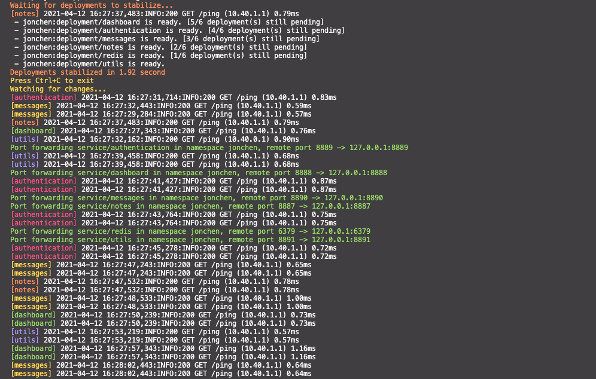

# Google Solutions - {{cookiecutter.project_name}}

Please contact {{cookiecutter.admin_email}}] for any questions.


# Development

## Overview
- We will use Fork-and-Branch workflow for all code submission. ([Reference](https://blog.scottlowe.org/2015/01/27/using-fork-branch-git-workflow/))
- All local code changes will be made in a fork, then be submitted as a Pull Request to merge back to the repo.

## Local development

For all python-based microservices, we will be using `skaffold` to build and deploy to a development GKE cluster. Currently we are using `{{cookiecutter.project_id}}`. (We will migrate to `aitutor-dev` soon.)

The following steps work for both:
- Backend Microservices ([deeplit-backend](https://github.com/GPS-Solutions/deeplit-backend))
- ML Microservices ([ml-pipeline](https://github.com/GPS-Solutions/ml-pipeline))

#### Initial setup for local development
After cloning the repo, please set up for local development. Please replace `<Github ID>` before running the command.

```
export PROJECT_ID={{cookiecutter.project_id}}
export SKAFFOLD_NAMESPACE=<Github ID>
gcloud auth login
bash ./setup/setup_local.sh
```

The output will look like this:


#### To build and run entire fleet in `{{cookiecutter.project_id}}` cluster
```
skaffold dev -p dev --default-repo=gcr.io/{{cookiecutter.project_id}} --port-forward
```
- This will build and run all microservices in the repo with port forwarding and live reload.
- For any changes to `*.py`, it will automatically reload the codes and update to the container. No need to re-run the command.

#### To build and run only Backend or only ML microservices

To run Backends microservices:

```
skaffold dev -p dev --default-repo=gcr.io/{{cookiecutter.project_id}} --port-forward -m backends
```

To run ML microservices:

```
skaffold dev -p dev --default-repo=gcr.io/{{cookiecutter.project_id}} --port-forward -m ml
```

#### To build and run a specific microservice
```
skaffold dev -p dev --default-repo=gcr.io/{{cookiecutter.project_id}} --port-forward -m <Microservice>
```
- This will build and run only the specific microservice in the repo with port forwarding and live reload.
- For any changes to `*.py`, it will automatically reload the codes and update to the container. No need to re-run the command.

`Microservice` could be one of the following in [deeplit-backend](https://github.com/GPS-Solutions/deeplit-backend):
- `authentication`
- `dashboard`
- `messages`
- `notes`
- `utils`

Or the following for ML microservices (in [deeplit-backend](https://github.com/GPS-Solutions/deeplit-backend) as well):
- `allennlp-const-parsing`
- `bert-paraphrase`
- `bert-paraphrase-tfserving`
- `choose-the-fact`
- `dialog-systems`
- `distilbert-mlm`
- `distilbert-tfserving`
- `feedback-allennlp`
- `unilm`

After running the `skaffold dev`, you will see the logs in your terminal like below:



You can now open directly to http://localhost:PORT in a browser, or use tools like Postman to test the API endpoints.

## Code Submission

### For the first-time setup
* Fork a repo
* git clone the fork to your local working directory.

### When making code changes
* Sync with the upstream repo. (i.e. the original repo in GPS-Solutions.)
* Commit and push changes to your own fork under a custom branch
* Create a PR (Pull Request)
  - This will automatically trigger the CI to run unit and integration tests. (WIP)
  - Once all tests passed, Repo admin approves the PR to merge to the master branch.
  - Optionally, Googler reviews the PR and runs Presubmit test with the PR against Google’s internal testing infrastructure.
  - For any issues, Repo admin comments on or rejects the PR.
* (For Google internal) A CL is automatically created based on the PR merge, and Googler reviews and submits the CL.
  - Another round of CL reviews and approvals is still required.

## Code Submission Flow Step-by-Step

### For the first-time setup:
* Create a fork of a Git repository
  - Go to the specific Git repository’s page, click Fork at the right corner of the page:

* Choose your own Github profile to create this fork under your name.

* Clone the repo to your local computer. (Replace the variables accordingly)
```
cd ~/workspace
git clone git@github.com:$YOUR_GITHUB_ID/$REPOSITORY_NAME.git
cd $REPOSITORY_NAME
```

  - If you encounter permission-related errors while cloning the repo, follow [this guide](https://docs.github.com/en/github/authenticating-to-github/generating-a-new-ssh-key-and-adding-it-to-the-ssh-agent) to create and add an SSH key for Github access (especially when checking out code with git@github.com URLs)
  - Alternatively, verify if the local git copy has the right remote endpoint.
```
git remote -v
# This will display the detailed remote list like below.
# origin  git@github.com:jonchenn/woz-frontend.git (fetch)
# origin  git@github.com:jonchenn/woz-frontend.git (push)
```

  - If for some reason, your local git copy doesn’t have the correct URL, run the following:
```
git remote add origin git@github.com:$YOUR_GITHUB_ID/$REPOSITORY_NAME.git
# or to reset the URL if origin remote exists
git remote set-url origin git@github.com:$YOUR_GITHUB_ID/$REPOSITORY_NAME.git
```

* Add the upstream (i.e. the repo under GPS-Solutions) to the remote list as “upstream”. (More info)
```
git remote add upstream git@github.com:GPS-Solutions/$REPOSITORY_NAME.git
```


### When making code changes

* Sync your fork with the latest commits in upstream/master branch. (more info)
```
# In your local fork repo folder.
git checkout -f master
git pull upstream master
```

* Create a new local branch to start a new task (e.g. working on a feature or a bug fix):
```
# This will create a new branch.
git checkout -b feature_xyz
```

* After making changes, commit the local change to this custom branch and push to your fork repo on Github. Alternatively, you can use editors like VSCode to commit the changes easily.
```
git commit -a -m 'Your description'
git push
# Or, if it doesn’t push to the origin remote by default.
git push --set-upstream origin $YOUR_BRANCH_NAME
```

  - This will submit the changes to your fork repo on Github.

* Go to the your Github fork repo web page, click the “Compare & Pull Request” in the notification. In the Pull Request form, make sure that:
  - The upstream repo name is correct
  - The destination branch is set to master.
  - The source branch is your custom branch.

* Alternatively, you can pick specific reviewers for this pull request.

* Once the pull request is created, it will appear on the Pull Request list of the upstream origin repository, which will automatically run tests and checks via a Continuous integration.

* If any tests failed, fix the codes in your local branch, re-commit and push the changes to the same custom branch.
```
# after fixing the code…
git commit -a -m 'another fix'
git push
```
  - This will update the pull request and re-run all necessary tests automatically.

  - If all tests passed, you may wait for the reviewers’ approval.

* Once all tests pass and get approvals from reviewer(s), the reviewer or Repo Admin will merge the pull request back to the origin master branch.

* For code reviewers, go to the Pull Requests page of the origin repo on Github.

  - Go inside the specific pull request page, review and comment on the request.
	- If all goes well with tests passed, click Merge pull request to merge the changes to the master branch.
  - Then grab a cup of coffee ☕  and take a break.


### Setting up GKE Cluster and develompent environment

#### Running all microservices

```
skaffold dev -p dev --default-repo=gcr.io/$PROJECT_ID
```

By default, it contains a `sample-service` microservice.
- Open http://localhost:8888/sample_service/v1/docs in a browser window
- Verify if you see the Swagger API documentations


## Development

### Prerequisites

Install required packages:

- For MacOS:
  ```
  brew install --cask skaffold kustomize google-cloud-sdk
  ```

- For Windows:
  ```
  choco install -y skaffold kustomize gcloudsdk
  ```

* Make sure to use __skaffold 1.24.1__ or later for development.

### Development process


#### Set up kubectl context and namespace

Export GCP project id and the namespace based on your Github handle (i.e. user ID)
```
export PROJECT_ID=<Your Project ID>
export SKAFFOLD_NAMESPACE=<Replace with your Github user ID>
```

Log in gcloud SDK:
```
gcloud auth login
```

Run the following to set up critical context and environment variables:

```
./setup/setup_local.sh
```

This shell script does the following:
- Set the current context to `gke_{{cookiecutter.project_id}}_{{cookiecutter.gcp_region}}_default_cluster`. The default cluster name is `default_cluster`.
  > **IMPORTANT**: Please do not change this context name.
- Create the namespace $SKAFFOLD_NAMESPACE and set this namespace for any further kubectl operations. It's okay if the namespace already exists.

## Run all microservices in GKE cluster

> **_NOTE:_**  By default, skaffold builds with CloudBuild and runs in GKE cluster, using the namespace set above.

To build and run in cluster:
```
skaffold run --port-forward

# Or, to build and run in cluster with hot reload:
skaffold dev --port-forward
```
- Please note that any change in the code will trigger the build process.

## Run with a specific microservice

```
skaffold run --port-forward -m <Microservice>
```

In this case, `Microservice` could be one of the following:
- Backend microservices:
  - `authentication`
  - `sample-service`

You can also run multiple specific microservices altogether. E.g.:

```
skaffold run --port-forward -m authentication,sample-service
```

## Deploy to a specific GKE cluster

> **IMPORTANT**: Please change gcloud project and kubectl context before running skaffold.

Replace the `<Custom GCP Project ID>` with a specific project ID and run the following:
```
export PROJECT_ID=<Custom GCP Project ID>

# Switch to a specific project.
gcloud config set project $PROJECT_ID

# Assuming the default cluster name is "default_cluster".
gcloud container clusters get-credentials default_cluster --zone us-central1-a --project $PROJECT_ID
```

Run with skaffold:
```
skaffold run -p custom --default-repo=gcr.io/$PROJECT_ID

# Or run with hot reload and live logs:
skaffold dev -p custom --default-repo=gcr.io/$PROJECT_ID
```

## Run with local minikube cluster

Install Minikube:

```
# For MacOS:
brew install minikube

# For Windows:
choco install -y minikube
```

Make sure the Docker daemon is running locally. To start minikube:
```
minikube start
```
- This will reset the kubectl context to the local minikube.

To build and run locally:
```
skaffold run --port-forward

# Or, to build and run locally with hot reload:
skaffold dev --port-forward
```

Optionally, you may want to set `GOOGLE_APPLICATION_CREDENTIALS` manually to a local JSON key file.
```
GOOGLE_APPLICATION_CREDENTIALS=<Path to Service Account key JSON file>
```

## Useful Kubectl commands

To check if pods are deployed and running:
```
kubectl get po

# Or, watch the live update in a separate terminal:
watch kubectl get po
```

To create a namespace:
```
kubectl create ns <New namespace>
```

To set a specific namespace for further kubectl operations:
```
kubectl config set-context --current --namespace=<Your namespace>
```
